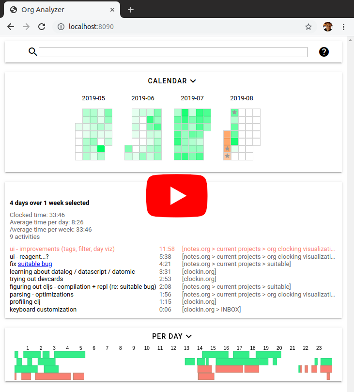

# org-analyzer

org-analyzer creates an interactive visualization of org-mode time-tracking
data. org-mode allows to add start/end timestamps to org-mode items (via
`org-clock-in`) to capture the times spend working on particular things.
Unfortunately the reporting features built into org-mode are rather limited.
This tool remedies that by providing a visual and interactive presentation
of time tracking data.

In other words, org-analyzer converts something like this

```org
* current projects
** org clockin visualization
*** ui - improvements (tags, filter, day viz)
:LOGBOOK:
CLOCK: [2019-08-04 Sun 23:35]--[2019-08-04 Sun 23:49] =>  0:14
CLOCK: [2019-08-04 Sun 13:51]--[2019-08-04 Sun 15:06] =>  1:15
CLOCK: [2019-08-04 Sun 04:25]--[2019-08-04 Sun 05:16] =>  0:51
...
:END:
```

into something like this:

[](https://www.youtube.com/watch?v=qBgvGDOxmUw)

### New features in 1.0

See this short walkthrough for what's new: https://youtu.be/BlLmtZUEULU

## Usage

org-analyzer should run on all platforms that can run JAVA — but you will need
to have that installed.

### Standalone

Download the [latest jar file](https://github.com/rksm/clj-org-analyzer/releases/latest)
and run it! (double click or from command line, see below). It will open a new browser window, if you close it the server will stop in a few seconds.

### Emacs

<!-- *2019-08-13: MELPA package is pending, see [the melpa pull request](https://github.com/melpa/melpa/pull/6365).* -->
<!-- For the time being, emacs support can be enabled by downloading the [emacs package](https://github.com/rksm/clj-org-analyzer/releases/download/1.0.3/org-analyzer-for-emacs-1.0.3.tar.gz) directly, extracting it and adding it to your load path and require it: -->
<!-- ```elisp -->
<!-- (add-to-list 'load-path "/path/to/org-analyzer-1.0.3/") -->
<!-- (require 'org-analyzer) -->
<!-- ``` -->
<!-- Afterwards, you can start the tool via `M-x org-analyzer-start`. -->

org-analyzer is on [](https://melpa.org/#/org-analyzer). Make sure MELPA is in your `package-archives`:

```elisp
(require 'package)
(add-to-list 'package-archives '("melpa" . "http://melpa.org/packages/"))
```

Then run `(package-install "org-analyzer")`. Afterwards, you can start the tool
via `M-x org-analyzer-start`.


## Commandline

Download the latest jar as described above and start it with `java -jar org-analyzer-1.0.3.jar`.

The following command line options are available, as per `java -jar org-analyzer-1.0.3.jar --help`:

```
Usage: java -jar org-analyzer-1.0.3.jar [opt*] [org-file-or-dir*]

Interactive visualization of timetracking data (org clocks).

This command starts an HTTP server that serves a web page that visualizes the
time data found in org files. Org files can be specified individually or, when
passing a directory, a recursive search for .org files is done. If nothing is
specified, defaults to the current directory, recursively searching it for any
.org file.

opts:
     --host hostname	Sets hostname, default is localhost
 -p, --port portnumber	Sets port, default is 8090
     --dontopen		Don't automatically open a web browser window

For more info see https://github.com/rksm/cljs-org-analyzer.
```


## Hacking

To play around with the codebase you will need to have [Clojure](https://clojure.org/guides/getting_started) installed.

To just run the app from source do a `git clone https://github.com/rksm/clj-org-analyzer` and then `make http-server`. Then visit http://localhost:8090.

You can run the server-side tests via `make test`. 

To work interactively, I would recommend an editor / IDE that uses [nREPL](https://nrepl.org/nrepl/0.6.0/index.html), I personally use Emacs with [cider](https://cider.mx). Start an nREPL server with `make nrepl` (this will also start an http-server) and then connect to localhost:7888 for a Clojure session and to localhost:7889 for a ClojureScript session.

If you don't use an nREPL enabled editor you can still run a figwheel repl via `make figwheel`.

Whe running with nREPL or figwheel you will get an additional page for UI experiments and tests: http://localhost:8090/expts.html

## License

[GPLv3](LICENSE)
